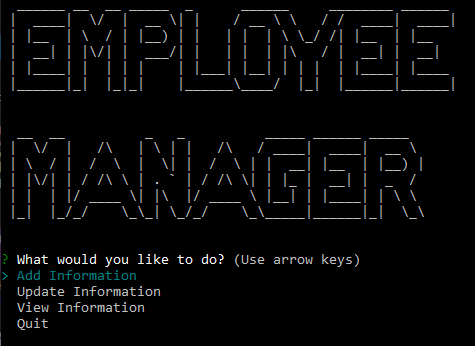

# Employee Tracker
## Description
This is a command-line application that a user can use to manage their company's database. This application uses Node.js, Inquirer, and MySQL.
## Usage
From the console run: node index.js
  

## Credits
Zach Smith - [GitHub Profile](https://github.com/Lemelisk27)  
## Questions  
If you have any questions you can contact me directly at Lemelisk27@gmail.com. You can also find more of my work on GitHub at [Lemelisk27](https://github.com/Lemelisk27)